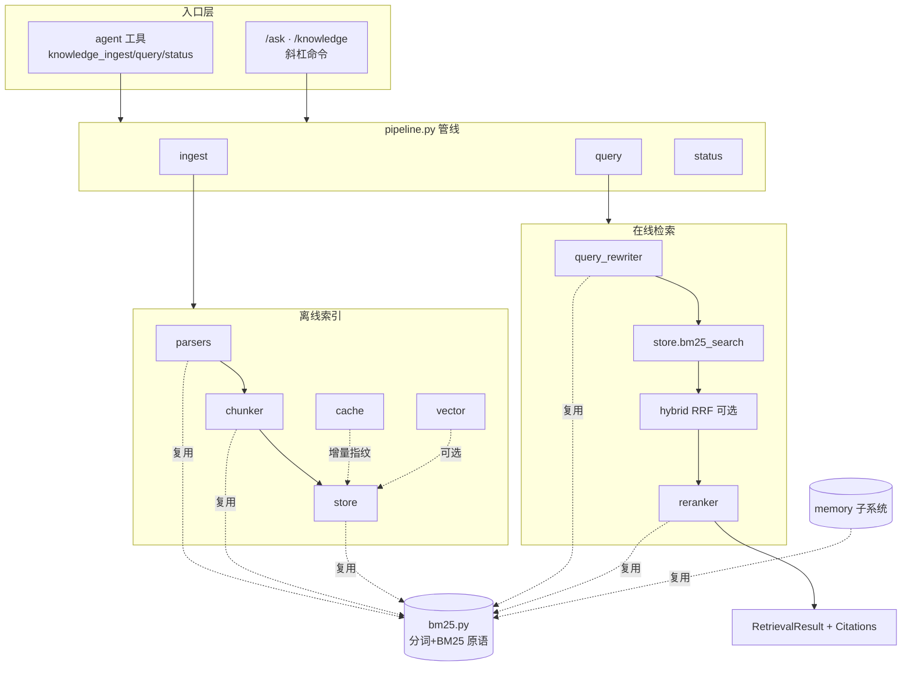

# MiniCode RAG 知识库集成 · 实现说明

> 本文记录 `docs/RAG_INTEGRATION_PLAN.md` 方案落地后的**实际实现**：交付了什么、
> 各模块如何协作、与现有 memory 子系统的复用关系、集成点、以及验收结果。
> 面向用户的使用手册见 `docs/knowledge.md`。

---

## 1. 一句话概览

在 MiniCode 中新增了 `minicode/knowledge/` 子包，为 agent 提供**外部文档知识库（RAG）**：
默认零依赖的 BM25 检索 + 启发式精排，可选安装 `[rag-vector]` 后升级为 hybrid（BM25 + 向量 RRF）。
agent 可通过工具调用、用户可通过 `/ask` 命令直接问知识库。

**核心约束（全部满足）**：
- 默认零外部依赖，纯标准库 + SQLite 即可运行
- 不破坏、不修改现有 memory 子系统的功能
- 向量能力 opt-in，未安装时透明降级
- 全量测试零回归

---

## 2. 交付清单

### 2.1 新增子包 `minicode/knowledge/`

| 文件 | 行为 | 依赖 |
|---|---|---|
| `types.py` | 数据契约：`Document` / `Chunk` / `RetrievalResult` / `Citation` / `IngestReport` | stdlib |
| `bm25.py` | 分词（英数 + CJK bigram）、中英术语扩展、BM25/TF-IDF 原语 | stdlib |
| `parsers.py` | 纯文本解析：多后缀、编码探测、大文件保护、目录遍历 | stdlib |
| `chunker.py` | 智能分块：markdown / 代码 / 纯文本三种策略 | stdlib |
| `store.py` | SQLite 存储 + 倒排索引 BM25 检索；可选 `VectorStore`(sqlite-vec) | stdlib |
| `cache.py` | 增量索引：sha256 指纹的变化检测（added/modified/deleted） | stdlib |
| `query_rewriter.py` | 查询改写：缩写还原 + 术语扩展 + 驼峰/蛇形拆分 | stdlib |
| `reranker.py` | 启发式精排：标题命中/覆盖率/长度/位置/代码信号 | stdlib |
| `pipeline.py` | 入口管线：`ingest` / `query` / `status` + 路径解析 | stdlib |
| `vector.py` | 【可选】embedding 后端抽象 + Mock/OpenAI 实现 | sqlite-vec |
| `hybrid.py` | 【可选】BM25 + 向量的 RRF 融合 | sqlite-vec |
| `eval.py` | 评测：MRR / Hit@K / Recall@K + CLI 入口 | stdlib |

### 2.2 集成改动（修改现有文件）

| 文件 | 改动 |
|---|---|
| `minicode/memory/memory.py` | BM25 原语**硬移动**到 `knowledge/bm25.py`，改为 `from ... import`（re-export，行为不变） |
| `minicode/tools/__init__.py` | 注册 `knowledge_ingest` / `knowledge_query` / `knowledge_status` 到 `_CORE_TOOLS` |
| `minicode/tooling.py` | 只读工具名集合追加 `knowledge_query` / `knowledge_status` |
| `minicode/cli_commands.py` | 新增 `/ask <question>` 与 `/knowledge` 命令 |
| `minicode/prompt/prompt.py` | 检测到索引存在时注入工具使用提示 |
| `pyproject.toml` | 新增 `[project.optional-dependencies] rag-vector` |

### 2.3 新增工具与测试

- `minicode/tools/knowledge_ingest.py` / `knowledge_query.py` / `knowledge_status.py`
- `tests/test_knowledge_basic.py`（M1 e2e）、`tests/test_knowledge.py`（完整套件 53 用例）
- `tests/fixtures/knowledge_corpus/`（5 个测试语料）
- `tests/test_cli_commands.py`（追加 `/ask`、`/knowledge` 测试）
- `docs/knowledge.md`（使用手册）、`docs/RAG_IMPLEMENTATION.md`（本文）

---

## 3. 架构与数据流

### 3.1 模块协作



### 3.2 离线索引流程（`ingest`）

```
docs/ 目录
  → parsers.iter_documents()   读文件 + 编码探测 → List[Document]
  → cache.diff_documents()     与已存 hash 比对 → 只挑 added/modified
  → chunker.chunk_document()   按类型切分 → List[Chunk]
  → store.upsert_document()    写 documents/chunks/inverted_index
  → (可选) vector.build_index() 算 embedding 存 vectors.db
  → 删除源已消失的文档
```

### 3.3 在线检索流程（`query`）

```
查询文本
  → query_rewriter.rewrite()   扩展同义词/缩写/驼峰 → 多变体
  → 分词 + 术语扩展            → query_tokens
  → store.bm25_search()        倒排索引召回 top-50
  → (可选) hybrid.fuse()       向量召回 + RRF 融合
  → reranker.rerank()          启发式精排 top-k
  → RetrievalResult(chunks + scores + citations)
```

---

## 4. 关键实现决策

### 4.1 BM25 共享而非重复实现
memory 原本内嵌了一套分词 + BM25。本次将其**硬移动**到 `knowledge/bm25.py`，
memory 改为 `from minicode.knowledge.bm25 import ...`。这样：
- 两个子系统共用同一套检索逻辑，避免漂移
- `_bm25_score` / `_compute_idf` 全仓库仅剩一处定义
- 因为是 re-export（不是垫片包装），`minicode.memory.memory._tokenize` 等符号仍可访问，
  现有 memory 测试（依赖这些导入）零改动通过

### 4.2 倒排索引驱动的 BM25
`store.bm25_search` 不做全表扫描：先用 `inverted_index` 召回含任一 query token 的候选 chunk，
再对候选逐个算 BM25，`idf` 由 `COUNT(*)` 现算，`avgdl` 由 chunk 长度均值现算。
适合中小型知识库，且完全落在 SQLite 内。

### 4.3 分块策略按 mime 分流
- **markdown**：维护标题栈，按 `#`/`##`/`###` 切分并记录标题路径（供 rerank 标题加权）
- **代码**：识别顶层 `def`/`class` 边界，保持定义整体不被拆散
- **纯文本**：段落聚合，超长段落再走滑动窗口（默认 512 字符 / 50 重叠）
- 过短碎片自动并入上一块，保证不产生噪声 chunk 且不丢文本

### 4.4 向量能力优雅降级
`vector.py` / `hybrid.py` 中所有入口都做了 `try: import sqlite_vec`。
以下任一情况自动回退到纯 BM25，**不报错不阻塞**：
未装 sqlite-vec / `embedding.enabled=false` / 向量库未建 / API key 缺失 / 网络失败。
`pipeline._maybe_hybrid` 捕获任何异常并 fallback。

### 4.5 `/ask` 不走 agent loop
`/ask` 直接：检索 → 拼 `<context>` → 调当前 model adapter 一次性生成 → 输出答案 + 折叠引用。
模型不可用（离线/未配置）时降级为直接展示检索到的原文片段与来源，保证任何环境都能用。

---

## 5. 存储布局

```
<workspace>/.mini-code/knowledge/<index_name>/   # 项目级（默认）
~/.mini-code/knowledge/<index_name>/             # 用户级（跨项目）
├── index.db      # SQLite: documents / chunks / inverted_index / manifest
├── vectors.db    # 【可选】sqlite-vec 向量表 chunk_vectors
└── meta.json     # 【可选】provider / model / dimension
```

`query` / `status` 不指定 scope 时按 project → user 顺序自动查找。

---

## 6. 数据类型契约

```
Document(id, source_path, content, mime, metadata)
    └─ chunk_document() ─▶ Chunk(id="<doc_id>#<pos>", doc_id, text, position,
                                 source_path, headings, metadata)
                                        │
                          bm25_search / rerank
                                        ▼
RetrievalResult(query, chunks[], scores[])
    ├─ .citations()       ─▶ Citation(chunk_id, source_path, text_excerpt, score, heading_path)
    └─ .format_context()  ─▶ 供 LLM 的 <context> 文本
```

---

## 7. 配置（settings.json · 全部可选）

```json
{
  "knowledge": {
    "default_index": "default",
    "default_scope": "project",
    "chunker": { "max_chunk_size": 512, "overlap": 50 },
    "embedding": {
      "enabled": false,
      "provider": "openai",
      "model": "text-embedding-3-small",
      "dimension": 1536,
      "api_key_env": "OPENAI_API_KEY"
    },
    "retrieval": {
      "default_top_k": 5,
      "bm25_top_n_for_rerank": 50,
      "vector_top_n_for_rerank": 50,
      "rrf_k": 60
    }
  }
}
```

配置读取走 `pipeline.load_knowledge_config()`，与默认值深合并，读取失败也不阻塞检索。

---

## 8. 使用速查

```bash
# 默认安装（零依赖，纯 BM25）
pip install -e .

# 启用向量增强
pip install -e ".[rag-vector]"

# 评测检索质量
python -m minicode.knowledge.eval --index default --dataset eval.jsonl
```

agent 工具：`knowledge_ingest(docs_dir, index_name, scope)` /
`knowledge_query(query, top_k)` / `knowledge_status(index_name)`。

用户命令：`/ask <question>`（RAG 问答）、`/knowledge`（列出索引）。

代码调用：

```python
from minicode.knowledge.pipeline import ingest, query, status
ingest("./docs", index_name="default", scope="project")
result = query("鉴权流程是怎样的", top_k=5)
for c, s in zip(result.chunks, result.scores):
    print(s, c.source_path, c.heading_path)
```

---

## 9. 验收结果（实测）

| 验收项 | 结果 |
|---|---|
| 全量 `pytest -q` | **371 passed**（基线 313 + 新增 58），pre-existing 的 9 failed / 11 errors / 2 skipped **计数不变 → 零回归** |
| BM25 定义唯一性 | `def _bm25_score` / `def _compute_idf` 仅存在于 `knowledge/bm25.py` |
| 4 个 console entry | `main` / `gateway` / `headless` / `cron_runner` 均可正常 import |
| 知识库工具注册 | `knowledge_ingest` / `knowledge_query` / `knowledge_status` 已进 registry |
| `/ask` 命令 | 无索引提示、空问题提示、模型不可用降级均验证通过 |
| 评测脚本 | 输出 MRR / Hit@K / Recall@K 数字正常 |
| 未装 sqlite-vec | 全部功能走 BM25 降级路径，无报错 |
| 中文检索 | 复用 CJK bigram 分词 + 中英术语扩展，中文查询命中正确 |
| 现有子系统 | memory / tools / prompt / agent 等测试全部保持通过 |

> 说明：仓库中的 9 failed / 11 errors 属集成前既已存在的 memory/agent 相关测试问题，
> 与本次 RAG 集成无关，本次未触碰相关代码，其计数在集成前后完全一致。

---

## 10. 扩展点

- **新 embedder**：`vector.py` 继承 `EmbeddingProvider` 实现 `embed_batch()`，在 `create_provider()` 注册
- **自定义 chunker**：`chunker.py` 按 mime 增加分支
- **新解析后缀**：`parsers.py` 的 `_SUFFIX_MIME` 添加映射
- **rerank 信号**：`reranker.py` 的 `rerank()` 追加启发式项

---

*Last updated: 2026-07-07*
